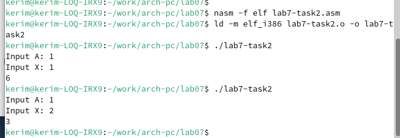

---
## Front matter
title: "Отчёт по лабораторной работе 7"
subtitle: "дисциплина: Архитектура компьютеров"
author: "Байрамов Керим Сапарович"

## Generic otions
lang: ru-RU
toc-title: "Содержание"

## Bibliography
bibliography: bib/cite.bib
csl: pandoc/csl/gost-r-7-0-5-2008-numeric.csl

## Pdf output format
toc: true # Table of contents
toc-depth: 2
lof: true # List of figures
lot: true # List of tables
fontsize: 12pt
linestretch: 1.5
papersize: a4
documentclass: scrreprt
## I18n polyglossia
polyglossia-lang:
  name: russian
  options:
	- spelling=modern
	- babelshorthands=true
polyglossia-otherlangs:
  name: english
## I18n babel
babel-lang: russian
babel-otherlangs: english
## Fonts
mainfont: PT Serif
romanfont: PT Serif
sansfont: PT Sans
monofont: PT Mono
mainfontoptions: Ligatures=TeX
romanfontoptions: Ligatures=TeX
sansfontoptions: Ligatures=TeX,Scale=MatchLowercase
monofontoptions: Scale=MatchLowercase,Scale=0.9
## Biblatex
biblatex: true
biblio-style: "gost-numeric"
biblatexoptions:
  - parentracker=true
  - backend=biber
  - hyperref=auto
  - language=auto
  - autolang=other*
  - citestyle=gost-numeric
## Pandoc-crossref LaTeX customization
figureTitle: "Рис."
tableTitle: "Таблица"
listingTitle: "Листинг"
lofTitle: "Список иллюстраций"
lotTitle: "Список таблиц"
lolTitle: "Листинги"
## Misc options
indent: true
header-includes:
  - \usepackage{indentfirst}
  - \usepackage{float} # keep figures where there are in the text
  - \floatplacement{figure}{H} # keep figures where there are in the text
---

# Цель работы

Целью работы является изучение команд условного и безусловного переходов. Приобретение навыков написания программ с использованием переходов. Знакомство с назначением и структурой файла листинга.

# Выполнение лабораторной работы

## Реализация переходов в NASM

Создал каталог для программ лабораторной работы № 7 и файл lab7-1.asm (рис. [-@fig:001]).

{ #fig:001 width=70%, height=70% }

В NASM инструкция jmp используется для реализации безусловных переходов. Рассмотрим пример программы с использованием инструкции jmp.
В файле lab7-1.asm разместил текст программы из листинга 7.1 (рис. [-@fig:002]).

{ #fig:002 width=70%, height=70% }

Создал исполняемый файл и запустил его (рис. [-@fig:003]).

{ #fig:003 width=70%, height=70% }

Инструкция jmp позволяет выполнять переходы как вперёд, так и назад. 
Изменил программу так, чтобы сначала выводилось сообщение № 2, затем сообщение № 1, после чего программа завершала работу. 
Для этого добавил в текст программы инструкцию jmp с меткой _label1 после вывода сообщения № 2 (чтобы перейти к инструкции вывода сообщения № 1) и инструкцию jmp с меткой _end после вывода сообщения № 1 (для перехода к инструкции call quit).

Обновил текст программы согласно листингу 7.2 (рис. [-@fig:004] и [-@fig:005]).

{ #fig:004 width=70%, height=70% }

{ #fig:005 width=70%, height=70% }

Изменил текст программы так, чтобы итоговый вывод программы выглядел следующим образом (рис. [-@fig:006] и [-@fig:007]):

Сообщение № 3 Сообщение № 2 Сообщение № 1

{ #fig:006 width=70%, height=70% }

{ #fig:007 width=70%, height=70% }

Инструкция jmp всегда вызывает переход. Однако часто в программировании требуются условные переходы, которые выполняются только при соблюдении определённых условий. 
В качестве примера рассмотрим программу, определяющую и выводящую наибольшее значение среди трёх целочисленных переменных A, B и C. 
Значения для A и C заданы в программе, а B вводится с клавиатуры.

Создал исполняемый файл и проверил его работу для различных значений B (рис. [-@fig:008] и [-@fig:009]).

{ #fig:008 width=70%, height=70% }

{ #fig:009 width=70%, height=70% }

## Изучение структуры файла листинга

Обычно NASM создаёт только объектный файл. Чтобы получить файл листинга, нужно указать ключ -l и задать имя файла листинга в командной строке. 

Создал файл листинга для программы из файла lab7-2.asm (рис. [-@fig:010]).

{ #fig:010 width=70%, height=70% }

Рассмотрим его структуру:

- **Строка 211**
  * 34 — номер строки
  * 0000012E — адрес
  * B8[00000000] — машинный код
  * mov eax, max — код программы

- **Строка 212**
  * 35 — номер строки
  * 00000133 — адрес
  * E864FFFFFF — машинный код
  * call atoi — код программы

- **Строка 213**
  * 36 — номер строки
  * 00000138 — адрес
  * A3[00000000] — машинный код
  * mov [max], eax — код программы

Открыл файл lab7-2.asm, удалил один из операндов в инструкции с двумя операндами и выполнил трансляцию с получением файла листинга (рис. [-@fig:011] и [-@fig:012]).

{ #fig:011 width=70%, height=70% }

{ #fig:012 width=70%, height=70% }

Из-за ошибки объектный файл не был создан. Однако, листинг указал местоположение ошибки.

## Самостоятельное задание

1. **Найти наименьшее среди трёх целочисленных переменных** a, b и c, используя значения из таблицы 7.5 для варианта, полученного при выполнении лабораторной работы № 6. Создать исполняемый файл и проверить его работу (рис. [-@fig:013] и [-@fig:014]).

   Для варианта 7: a = 45, b = 67, c = 15.

   { #fig:013 width=70%, height=70% }

   { #fig:014 width=70%, height=70% }

2. **Программа для вычисления функции** f(x) при введённых значениях x и a с клавиатуры. Вид функции f(x) выбирается из таблицы 7.6 в зависимости от варианта, полученного для лабораторной работы № 7. Создать исполняемый файл и проверить его работу для значений x и a из таблицы 7.6 (рис. [-@fig:015] и [-@fig:016]).

   Для варианта 7:
   
   $$
   f(x) = 
   \begin{cases}
    6a, & x = a \\
    a+x, & x \ne a
   \end{cases}
   $$

   При $x = 1$, $a = 1$ результат — 6.

   При $x = 2$, $a = 1$ результат — 3.

   { #fig:015 width=70%, height=70% }

   { #fig:016 width=70%, height=70% }

# Выводы

Изучили команды условного и безусловного переходов, познакомились с фалом листинга.