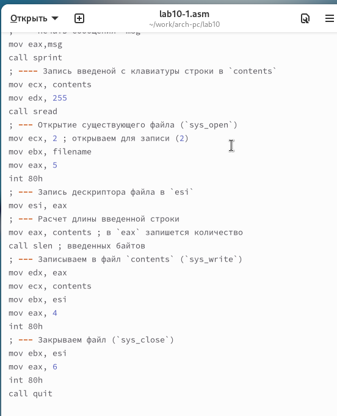
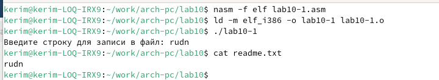
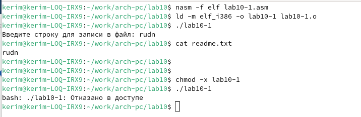
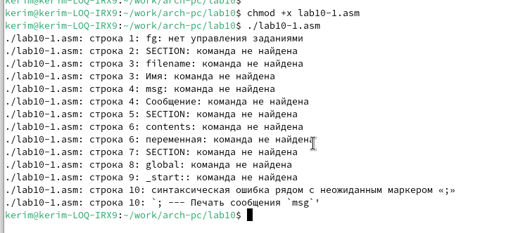
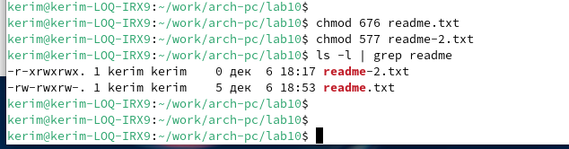
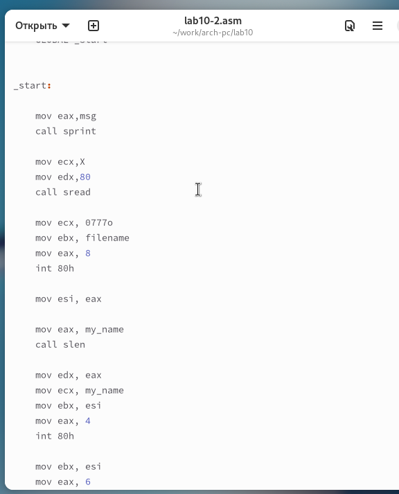
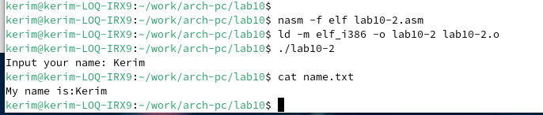

---
## Front matter
title: "Отчёт по лабораторной работе 10"
subtitle: "дисциплина: Архитектура компьютеров"
author: "Байрамов Керим Сапарович"

## Generic otions
lang: ru-RU
toc-title: "Содержание"

## Bibliography
bibliography: bib/cite.bib
csl: pandoc/csl/gost-r-7-0-5-2008-numeric.csl

## Pdf output format
toc: true # Table of contents
toc-depth: 2
lof: true # List of figures
lot: true # List of tables
fontsize: 12pt
linestretch: 1.5
papersize: a4
documentclass: scrreprt
## I18n polyglossia
polyglossia-lang:
  name: russian
  options:
	- spelling=modern
	- babelshorthands=true
polyglossia-otherlangs:
  name: english
## I18n babel
babel-lang: russian
babel-otherlangs: english
## Fonts
mainfont: PT Serif
romanfont: PT Serif
sansfont: PT Sans
monofont: PT Mono
mainfontoptions: Ligatures=TeX
romanfontoptions: Ligatures=TeX
sansfontoptions: Ligatures=TeX,Scale=MatchLowercase
monofontoptions: Scale=MatchLowercase,Scale=0.9
## Biblatex
biblatex: true
biblio-style: "gost-numeric"
biblatexoptions:
  - parentracker=true
  - backend=biber
  - hyperref=auto
  - language=auto
  - autolang=other*
  - citestyle=gost-numeric
## Pandoc-crossref LaTeX customization
figureTitle: "Рис."
tableTitle: "Таблица"
listingTitle: "Листинг"
lofTitle: "Список иллюстраций"
lotTitle: "Список таблиц"
lolTitle: "Листинги"
## Misc options
indent: true
header-includes:
  - \usepackage{indentfirst}
  - \usepackage{float} # keep figures where there are in the text
  - \floatplacement{figure}{H} # keep figures where there are in the text
---

# Цель работы

Целью работы является приобретение навыков написания программ для работы с файлами.

# Выполнение лабораторной работы

Я создал каталог для лабораторной работы №10 и перешел в него. 
Внутри каталога я создал три файла: `lab10-1.asm`, `readme-1.txt` и `readme-2.txt`.

В файле `lab10-1.asm` я написал программу согласно листингу 10.1, 
которая записывает сообщение в файл. После этого я скомпилировал этот код в 
исполняемый файл и проверил его работу (рис. [-@fig:001]).

{ #fig:001 width=70%, height=70% }

Данная программа запрашивает строку и записывает её в файл `readme.txt`. 
Однако, если указанный файл отсутствует, он не создается, и строка не записывается (рис. [-@fig:002]).

{ #fig:002 width=70%, height=70% }

Чтобы запретить выполнение исполняемого файла `lab10-1`, я использовал команду `chmod` для изменения прав доступа и снял атрибут "x" во всех трех позициях. 

После этого я попытался запустить файл, но запуск не удался, так как атрибут "x" был снят (рис. [-@fig:003]).

{ #fig:003 width=70%, height=70% }

Далее я изменил настройки доступа к файлу `lab10-1.asm`, добавив разрешение на его выполнение с помощью команды `chmod`. Затем я попытался запустить файл (рис. [-@fig:004]). 

Файл запустился, но терминал попытался интерпретировать его содержимое как команды. Поскольку это файл с кодом на ассемблере, а не команды для терминала, произошли ошибки.

{ #fig:004 width=70%, height=70% }

После этого я настроил права доступа к файлам `readme` в соответствии с таблицей 10.4. Для проверки корректности выполненных действий я использовал команду `ls -l` и вывел атрибуты (рис. [-@fig:005]).

Для варианта 7: ```rw- rwx rw-``` ```101 111 111```

{ #fig:005 width=70%, height=70% }

## Самостоятельное задание

Я написал программу, которая работает по следующему алгоритму (рис. [-@fig:006], [-@fig:007]):

1. Вывести приглашение: “Как Вас зовут?”.
2. Ввести с клавиатуры фамилию и имя.
3. Создать файл с именем `name.txt`.
4. Записать в файл сообщение “Меня зовут”.
5. Дописать в файл строку, введенную с клавиатуры.
6. Закрыть файл.

{ #fig:006 width=70%, height=70% }

{ #fig:007 width=70%, height=70% }

# Выводы

Я освоил работу с файлами и правами доступа в операционной системе.
